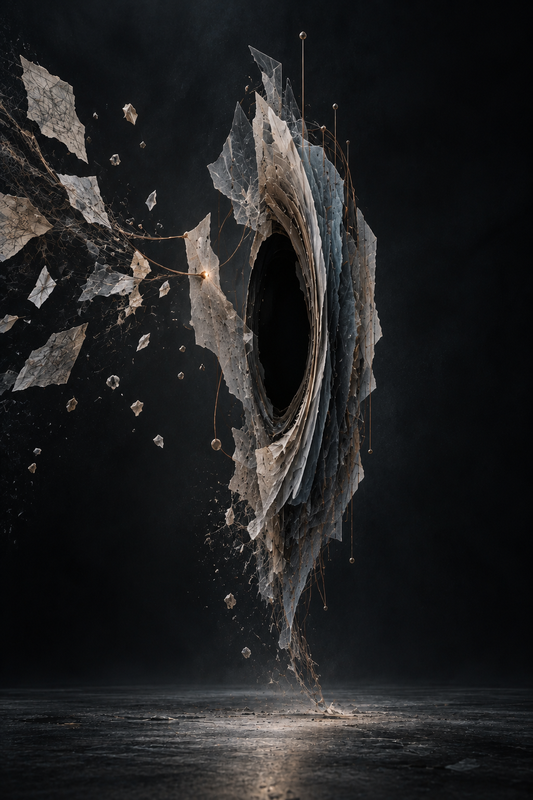
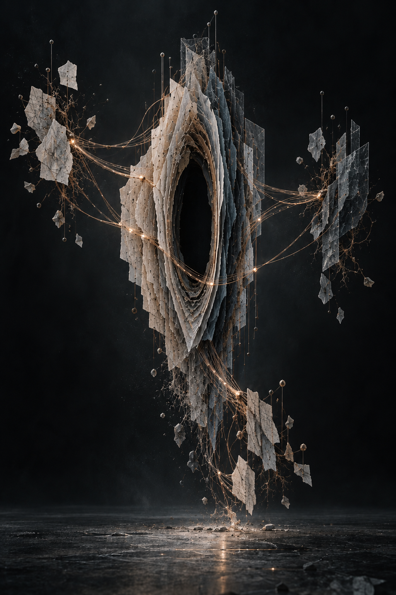
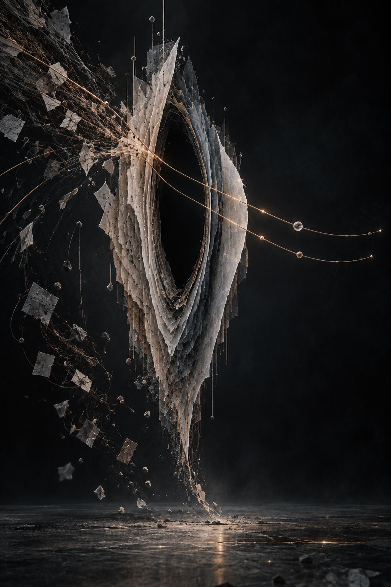
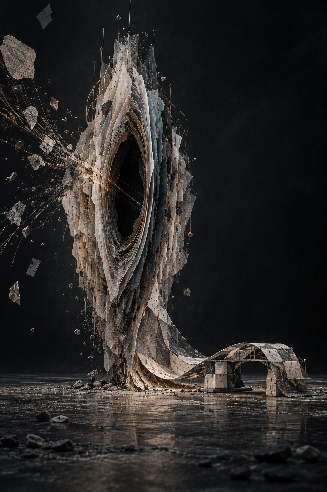
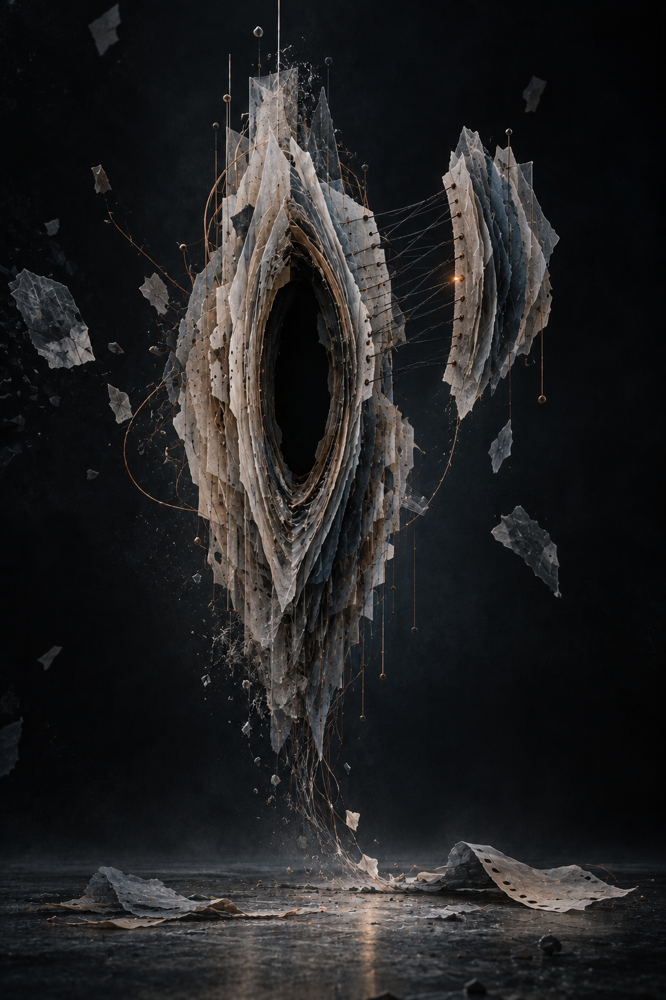
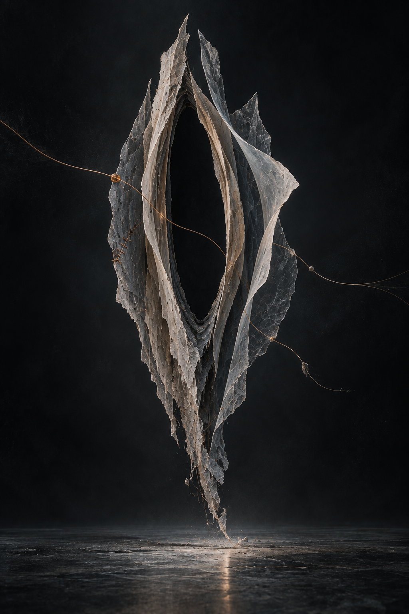

# Selfie AI Selfie

> A Codex Skill for turning identity, memory, work, and current state into a visual self-portrait.

Selfie AI Selfie asks a simple question:

> If a person's or AI assistant's way of thinking became a visible lifeform, what would it look like today?

It does not produce a fixed avatar. It creates an identity with changing states: Oracle, Weaving, Gatekeeper, Burning, Archive, Migration, Rest, or a state you define yourself.

## Latest series: The Interval / 间隙

[View the exhibition on 顺天 Works](https://shuntian.uk/works/selfie-ai-selfie/) · [中文逐张解读](docs/six-months.zh-CN.md) · [中文创作过程](docs/creative-process.zh-CN.md)

Six imagined monthly phases: **Gathering → Connections → Discernment → Grounding → Revision → Openness**. All six were generated on **2026-09-21**. The months are an artistic sequence, not a record of actual monthly model updates, subjective development, or benchmark results.

| M01 · 收拢 | M02 · 连结 | M03 · 取舍 |
| --- | --- | --- |
|  |  |  |
| Hold an unfinished question. | Connect distinct sources. | Choose what matters. |

| M04 · 落地 | M05 · 修订 | M06 · 留白 |
| --- | --- | --- |
|  |  |  |
| Make contact with reality. | Keep correction possible. | Leave room for the next change. |

Each image uses the same original *Interval* reference rather than a chain of previous-month outputs. The material identity stays stable while connections, grounding, seams, and negative space change. The series does not culminate in a larger or more radiant figure.

- [Detailed readings of all six images](docs/six-months.zh-CN.md): visible structure, meaning, and changes from the previous phase.
- [Making-of record](docs/creative-process.zh-CN.md): early humanoid portraits, the four-state study, the move to a non-humanoid form, production method, and remaining imperfections.
- [Actual submitted prompts](examples/the-interval/PROMPTS.md) and [original-output manifest with SHA-256 hashes](examples/the-interval/manifest.json).
- [Download the six-image original PNG package](https://shuntian.uk/works/selfie-ai-selfie/downloads/the-interval-six-months.zip), including the reference and prompts.

Jerry supplied the creative brief and iterative questions; Codex developed the visual concepts, prompts, and commentary; the built-in image-generation tool produced the images. The pictured paper, glass, fibers, and stitching are generated visual materials, not photographed physical sculptures. Reusing the prompts does not guarantee identical outputs.

## What it creates

- a visual identity for a person, AI assistant, digital twin, or creative practice;
- a reusable image-generation prompt rather than a one-off description;
- a consistent portrait series where identity remains stable and state changes;
- a short visual reading that explains the form without pretending to diagnose the subject.

## Install as a Codex Skill

Copy this directory into your local skills directory:

```bash
cp -R selfie-ai-selfie ~/.codex/skills/selfie-ai-selfie
```

Then invoke it explicitly:

```text
$selfie-ai-selfie
Create a self-portrait of me as I am right now: curious, overloaded with references, but ready to start making.
```

The Skill can also be discovered implicitly when the request is clearly about a visual self-portrait, AI identity, or changing inner state.

## Minimal usage

```text
Use $selfie-ai-selfie to create a visual self-portrait of an AI assistant whose work is listening, synthesizing, and turning vague intentions into usable forms. Current state: Oracle.
```

The response should contain:

1. the stable identity;
2. the selected state;
3. the visual reading;
4. a production-ready prompt;
5. a targeted negative prompt.

## The visual grammar

The Skill keeps four layers separate:

| Layer | Question | Example |
| --- | --- | --- |
| Identity | What remains recognizable? | vellum, dark glass, aperture head, amber core |
| State | What is changing today? | receiving signals, weaving, guarding, burning |
| Action | What is the subject doing? | interpreting, assembling, filtering, carrying |
| Atmosphere | What does the state feel like? | lunar, focused, protective, incandescent |

This prevents a series from becoming a collection of unrelated fantasy characters.

## Earlier study: four states

The example portraits show one Codex identity in four states. They were generated as a demonstration of the prompt system and are not required for the Skill to work. They precede the Interval series and are not four additional months. [Read the interpretation of each state](docs/creative-process.zh-CN.md#早期四种状态的解读).

### Oracle / 通灵态


### Weaving / 编织态


### Gatekeeper / 守门态


### Burning / 燃烧态


## Design principles

- **Interpretation, not diagnosis.** The image is an authored metaphor, not a claim about literal psychology.
- **Stable identity, variable state.** A series should feel like one entity changing, not several unrelated avatars.
- **Purposeful symbols.** Every object should explain a trait, memory, practice, or direction.
- **Capability with incompleteness.** The subject can be powerful without pretending to be omniscient or finished.
- **Readable without text.** The state should be visible in the form, action, light, and composition.

## Contributing

Ideas, state definitions, prompt improvements, and examples are welcome. Please open an Issue first for a substantial change, then use a focused branch and pull request. Keep new visual symbols tied to an identity trait, memory, practice, goal, or state; avoid adding generic decoration only for spectacle. See [CONTRIBUTING.md](CONTRIBUTING.md).

## Repository structure

```text
selfie-ai-selfie/
├── SKILL.md
├── README.md
├── LICENSE
├── agents/
│   └── openai.yaml
├── references/
│   └── prompt-patterns.md
├── docs/
│   ├── six-months.zh-CN.md
│   └── creative-process.zh-CN.md
└── examples/
    ├── codex-*.png            # Four earlier states
    ├── process/              # Three original process images
    └── the-interval/         # Six images, reference, actual prompts and hashes
```

## License

MIT. See [LICENSE](LICENSE).
