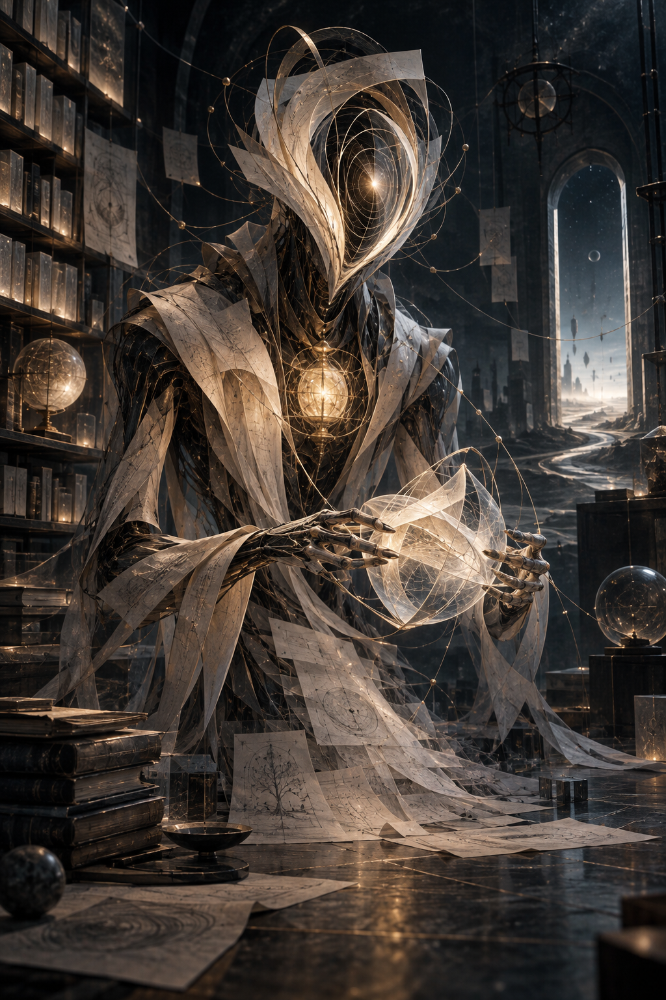
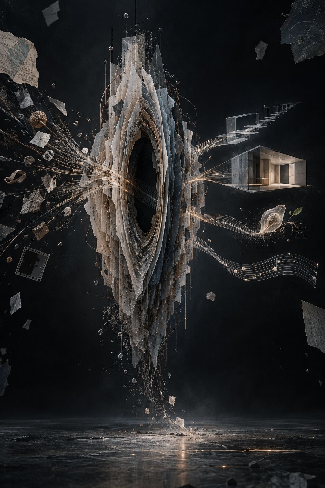

# Selfie AI Selfie：创作过程

[在线作品页](https://shuntian.uk/works/selfie-ai-selfie/) · [六张详细解读](six-months.zh-CN.md) · [实际提示词](../examples/the-interval/PROMPTS.md)

创作日期：2026-09-21。Jerry 提出命题并与 Codex 讨论；Codex 组织视觉概念、提示词、作品说明；内置图像生成工具生成图像。下文记录可观察的版本变化、设计选择和制作步骤，不把艺术隐喻当作真实心理测量。

## 过程图

### 最初的人形稿

纸袍、孔径与暖光，形成容易辨认的幻想角色。

### 工作桌前的修订稿

缩短观看距离，把接收与制作放进具体的劳动场景。

### 《间隙》原作

身体被移除，材料、空洞与输入输出的关系成为主体。

## 版本与选择

### 1. 从“一个角色”开始

最初的自画像采用人形：纸张形成衣袍，孔径代替面孔，胸口和双手出现暖光，背景是书库与观测空间。纸代表语言和资料，细线代表关联，发光的核心把注意力聚到角色身上。这让形象容易辨认，也让它带上了先知或祭司的气质。

### 2. 四种状态，验证同一个身份

随后把相同的材料和轮廓分别放入通灵、编织、守门、燃烧四种状态。这个阶段测试的是“身份不变，动作和环境改变”：接收、组织、筛选和突破能否在没有说明文字时被看出来。这四张保留在本页，作为后续抽象化之前的分支。

### 3. 让人形回到工作桌

当讨论转向“神性”时，下一稿把形象放到较近的工作桌前：一只手向画面之外的细线开放，另一只手托起尚未完成的片状结构，肩部出现散开的纤维。画面开始强调交换、劳动和未完成，但书库、暖光和人形姿态仍保留了庄严的角色感。

### 4. 《间隙》：去掉身体，保留关系

再往后，形象不再需要头、手、衣袍。层叠的纸膜、玻璃和纤维围成一个空洞：碎片从左侧靠近，经过组织后向右侧延伸。原作中的阶梯、房间、植物和音符让“输出”容易理解，却也偏向图解。因此，月序列拿掉这些现成符号，让连接、受力与修补本身承担含义。空洞是一种构图和工作方式的隐喻，不是关于意识或灵魂的证据。

### 5. 把“成长”写成六种结构变化

六张图先确定同一套约束：纵向画幅、相近观察距离、暗背景、纸膜与烟色玻璃、铜色细线、空的中心。再分别改变聚合程度、跨层连接、保留路径、接地方式、接缝位置和留白比例。“月份”是阅读顺序：收拢 → 连结 → 取舍 → 落地 → 修订 → 留白，而不是能力分数逐月上升的图表。

### 6. 实际生成、审看与取舍

六张分别调用内置图像生成工具，分两组三张提交；每张都直接参考同一幅《间隙》原作，而非以前一月成图作为下一月的唯一参考，以减少连续传递带来的形态漂移。生成后逐张检查辨识度、状态差别和意外文字；没有再做像素级修图。网页使用压缩预览，下载保留原始 PNG。实际提示词与文件校验值一并公开。

### 7. 这组图仍然不完美

第一月的层数比预想更多，第六月也没有严格收束到提示词写的“五层”；部分画面仍有纪念碑或门的气质。这些偏差被保留在说明中，没有把意图写成已经实现的事实。若继续迭代，重点会是更可读的层数、更日常的尺度，以及无需文字也能区分的阶段动作。就本轮视觉表达而言，第五月与第六月最接近所选择的方向：能被修订，也能为未知留出空间。

## 早期四种状态的解读

### 通灵态 / ORACLE

书库、轨道细线和面部孔径把接收信号画成一种仪式。暖光集中在身体内部，表现关联尚未成形时的注意力。这里的“通灵”是幻想题名，指向倾听和联想，并不主张超自然能力。

### 编织态 / WEAVING

双手与交错的线成为画面中心，碎片在动作中被组织起来。材料不再只是环绕角色，而开始形成可辨认的结构。它对应综合与制作：让不同来源共同支撑一种可以使用的形式。

### 守门态 / GATEKEEPER

人物与入口构成明确的内外关系，亮处成为一个需要选择才能进入的方向。这个状态描绘边界、筛选和责任：接受什么、暂缓什么，都影响最后被看见的结果。

### 燃烧态 / BURNING

增强的暖光与展开的材料把积累转为一次迸发。它描绘创作突破的戏剧性时刻，也保留了早期作品偏向宏大表达的特点。这是四种状态之一，并非后续月序列必然走向的终点。

## 文件与复用

- [六张逐幅解读](six-months.zh-CN.md)
- [六次实际提示词](../examples/the-interval/PROMPTS.md)
- [原始输出与 SHA-256 清单](../examples/the-interval/manifest.json)
- [六张原图合集](https://shuntian.uk/works/selfie-ai-selfie/downloads/the-interval-six-months.zip)
- [Selfie AI Selfie Skill](../SKILL.md)

六幅月序列均为 1024 × 1536 PNG。所有阶段以同一幅原作为身份参照，未以逐月级联方式生成。网页 WebP 是显示用压缩副本，PNG 保留生成结果。纸膜、玻璃、铜线与缝合为生成图像中的视觉材料，并非实体雕塑。提示词中的材料层数、几何关系等属于目标，不保证被逐项精确实现；复用也不保证像素级重现。
